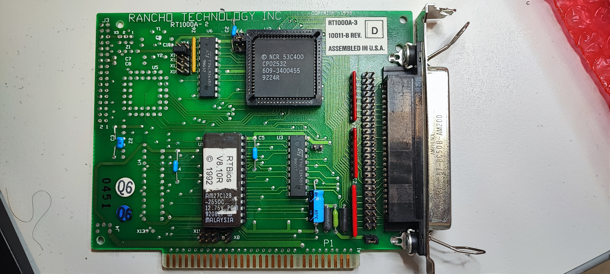

# Rancho-RT1000-SCSI-8-Bit
Recreation of a bootable ISA 8-Bit SCSI Card.

There can be one PAL on the Card (GAL20L8), this is for the floppy part only.
BIOS EPROM is a 27C128 Type, but only 8k are used.

[Schematic](schematic/Rancho%20RT1000/pdf/Rancho%20RT1000%20SCSI%20Controller.pdf)

For now there is no plan to manufacture the board.

| BIOS Ver.   | 8088/80C88 |   286   |  386SX  |  386DX     |   486   |
| Rancho 8.10 |            |         |         | boots+ASPI |         |
| Rancho 8.20 |            |         |         | Comment 1  |         |
| Corel 1.65  |            |         |         |            |         |

Comment 1: Bootcode found, tries to access the disk and hangs, without Boot BIOS
    Computer startts and ASPI works.

Card works in my XT but the ASPI driver doesn't.
The Card semms to be the same as the Corel LS2000, so i tried the Corel BIOS and it works!
Unfortunately the Corel uses a different CHS Conversion, so the Rancho Images won't work.

Heads and Sectors working with original RT1000 BIOS (v8.20):

Tested with MSDOS 5 and with a 386SX and does NOT work with an 8088 nor 80C88!:

(spc = Sectors/Cluster, spf = Sectors/FAT)

* C: 1023 / H:2  / S:32 32 MB (FAT16/4) spc=4,spf=0x40: works
* C: 1023 / H:4  / S:32 64 MB (FAT16/6) spc=4,spf=0x80: non-system disk
* C:  511 / H:8  / S:32 64 MB (FAT16/6) spc=4,spf=0x80: non-system disk
* C: 1015 / H:3  / S:43 65510 kB (FAT16/6) spc=4,spf=0x80: works
* C: 1023 / H:8  / S:32 128 MB (FAT16/6) spc=4,spf=0x100: non-system disk
* C: 1007 / H:5  / S:52 127.8 MB (FAT16/6) spc=4,spf=0x100: works
* C: 1021 / H:9  / S:57 261800 kB (FAT16/6) spc=8,spf=0x100: works
* C: 1023 / H:9  / S:57 262627 kB (FAT16/6) spc=16,spf=0x100: non-system disk
* C: 1010 / H:17  / S:60 515072 kB (FAT16/6) spc=16,spf=0xFC: works
* C: 1011 / H:31  / S:62 948 MB (FAT16/6) spc=32,spf=0xEE: works

Heads and Sectors working with Corel LS2000 BIOS (v1.65):

Tested with 386SX and does NOT work with an 8088!:

* C:  961 / H:17 / S:8 63.1 MB (FAT16/6) spc=4,spf=0x80: works
* C:  961 / H:17 / S:16 127.6 MB (FAT16/6) spc=4,spf=0xFF: works
* C: 1021 / H:32 / S:16 255.5 MB (FAT16/6) spc=16,spf=0x80: works
* C:  597 / H:64 / S:16 299 MB (FAT16/6) spc=16,spf=0x96: works
* C: 1003 / H:64 / S:16 502 MB (FAT16/6) spc=16,spf=0xFB: works
* C: 1019 / H:64 / S:16 509.9 MB (FAT16/6) spc=16,spf=0xFF: works
* C:  570 / H:64 / S:32 570.5 MB (FAT16/6) spc=32,spf=0x8F: works
* C:  571 / H:64 / S:32 572 MB (FAT16/6) spc=32,spf=0x8F: works
* C:  667 / H:64 / S:32 668 MB (FAT16/6) spc=32,spf=0xA7: works
* C:  762 / H:64 / S:32 763 MB (FAT16/6) spc=32,spf=0xBF: works
* C:  859 / H:64 / S:32 860 MB (FAT16/6) spc=32,spf=0xD7: works
* C:  903 / H:64 / S:32 904 MB (FAT16/6) spc=32,spf=0xE2: works
* C:  927 / H:64 / S:32 927.9 MB (FAT16/6) spc=32,spf=0xE8: works
* C: 1019 / H:64 / S:32 1020 MB (FAT16/6) spc=32,spf=0xFF: works
* C:  946 / H:64 / S:32 947 MB (FAT16/6) spc=32,spf=0xED: doesn't work
* C:  946 / H:64 / S:32 947 MB (FAT16/6) spc=32,spf=0xFB: doesn't work
